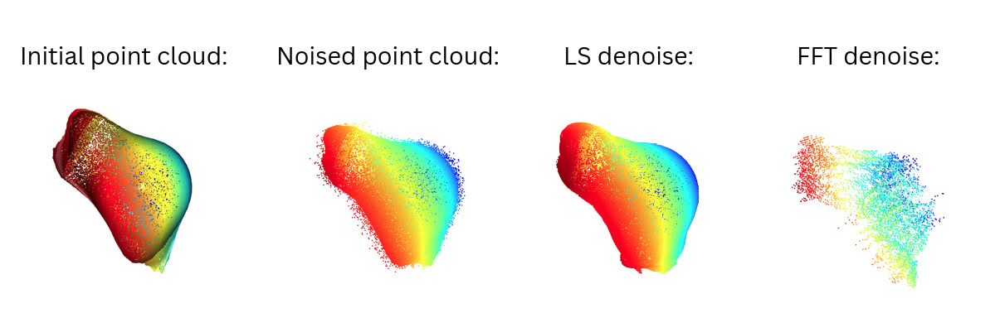
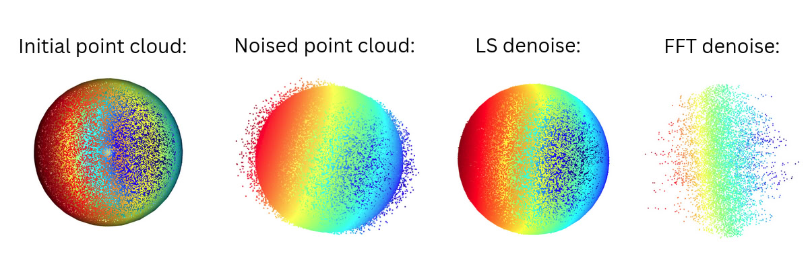

# pcd - point cloud denoising
Point cloud denoising library for Python.  
## Installation
Download the [pixi package manager](https://pixi.sh/latest/), this will manage the installation of all required packages.  

Clone and install dependencies:
```
git clone https://github.com/n1n1n1q/pcd
cd pcd
pixi install
```
To run different examples:
```
pixi run {example-fft, example-ls, example-split, example-blob}
```
To activate conda enviroment:
```
pixi shell
```
## Methods
The main focus of the project is exploring classical LA approaches for reducing noise in point clouds. 

### Fourier Transform (FFT) Denoising
The FFT denoising method projects the point cloud onto a 2D grid, applies a Fourier transform to filter out high-frequency noise components, and then reconstructs the 3D point cloud from the filtered grid. This approach is particularly effective for point clouds with structured noise patterns.

### Least Squares (LS) Denoising
The LS denoising method fits a local parametric surface to neighborhoods of points using least squares regression. By approximating the underlying smooth surface, this method can effectively remove random noise while preserving geometric features.

### Local Denoising
Local denoising applies denoising algorithms to subsets of the point cloud and then combines the results:

Local LS: Applies the least squares fitting algorithm to local patches of the point cloud.
Local FFT: Applies Fourier filtering to local regions of the point cloud.
Both local methods work by:
* Partitioning the point cloud into overlapping regions
* Processing each region independently using either LS or FFT
* Merging the denoised regions to form the final point cloud
### Metrics
To evaluate denoising performance, we use:

Chamfer Distance: Measures the average distance between points in the denoised cloud and their nearest neighbors in the original cloud
Hausdorff Distance: Represents the maximum distance between a point in the denoised cloud and its nearest neighbor in the original cloud
Processing Time: Records the computational efficiency of each method
## Results
For now, we have tested (global) FFT and local LS approaches. The followin results were obtained:

| Model Type | Method              | Hausdorff Distance | Chamfer Distance | Denoising Time | Notes                      |
|------------|---------------------|--------------------|------------------|----------------|----------------------------|
| Blob       | LS Denoising         | 0.1221             | 0.0080           | 2.61 s         | Denoising with LS done     |
| Blob       | Fourier Denoising    | 0.9437             | 0.3612           | 0.65 s         | Denoising with Fourier done|
| Sphere     | LS Denoising         | 0.0203             | 0.0017           | 2.50 s         | Denoising with LS done     |
| Sphere     | Fourier Denoising    | 0.9429             | 0.4005           | 0.58 s         | Denoising with Fourier done|

See visual comparison:

*Blob denoising comparison*


*Sphere denoising comparison*

## Future Work
Although the project is almost finished, there is some work to do.

- [] Tweak FFT denoise
- [] Prepare a dataset with more models and upload it to GitHub
- [] Evaluate all the approaches (both global and local)
- [] Fix some misc functions (save, load etc)

## Authors
* [Basystyi Oleh](https://github.com/n1n1n1q)
* [Stasyshyn Anna]()
* [Zhuk Maksym]()
